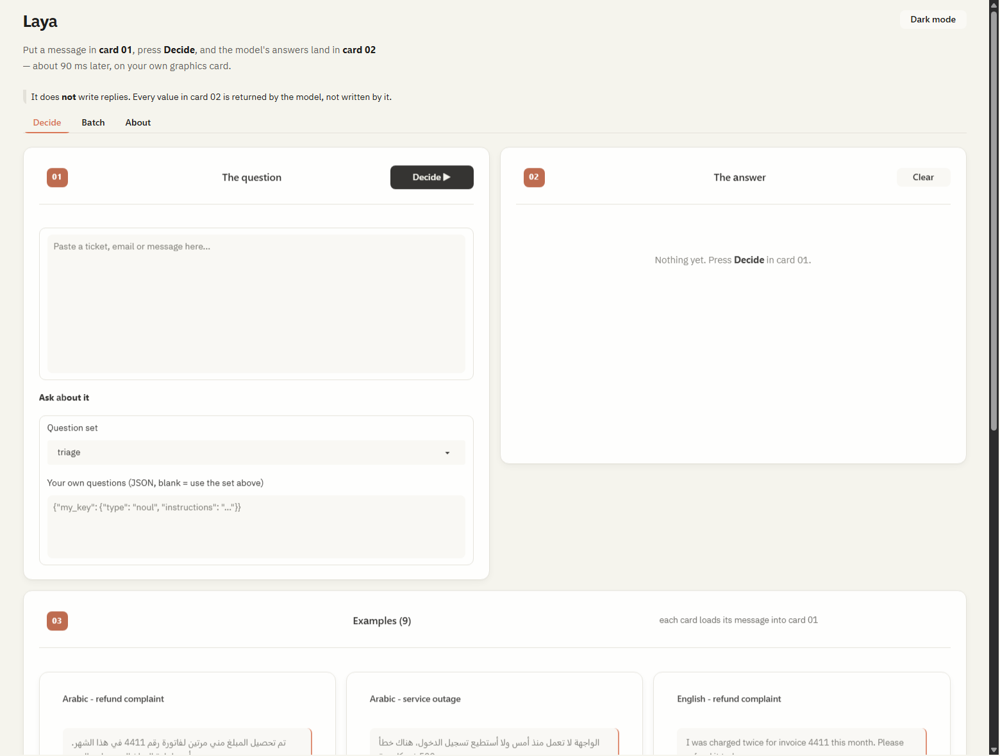
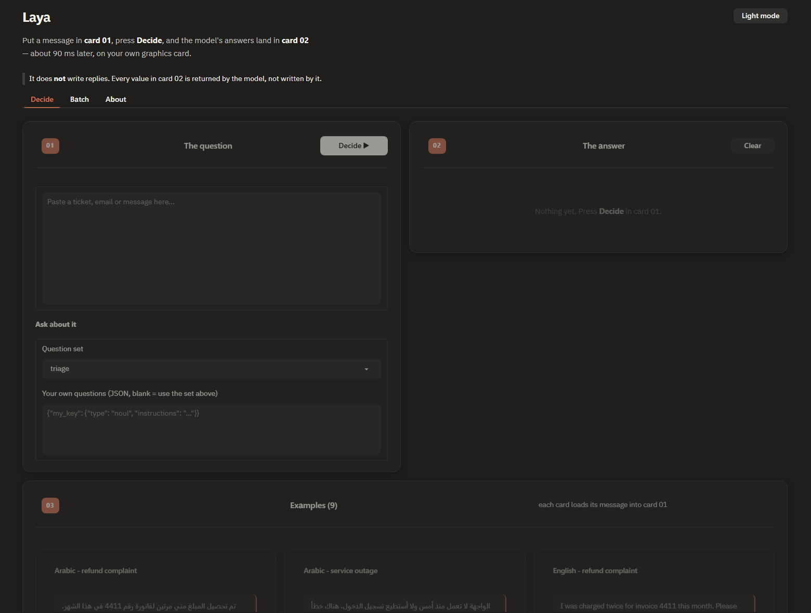

# classifiers-test

Two small local classifiers behind one page. You pick which one you want before
anything loads.

| | **Text** | **Image** |
|---|---|---|
| Model | [`laya-multilingual`](https://huggingface.co/convaiinnovations/laya-multilingual) | [`ai-vs-human-image-detector`](https://huggingface.co/Ateeqq/ai-vs-human-image-detector) |
| Gives you | typed decisions about a message | `ai` or `hum` for a picture |
| Speed | ~85 ms | ~71 ms |
| VRAM | 1884 MB | 402 MB |

Neither writes prose. A classifier answers a question; it does not compose.

---

## Try it

```powershell
git clone https://github.com/mventor-git/classifiers-test
cd classifiers-test
powershell -ExecutionPolicy Bypass -File installer.ps1
powershell -ExecutionPolicy Bypass -File start.ps1
```

`installer.ps1` detects your GPU, picks the right PyTorch build, installs 65 pinned
packages, fetches both models, and verifies everything. Re-run it whenever: a
model already on disk is reported as present and not downloaded again.

`start.ps1` then **asks which classifier you want**:

```
  Which classifier do you want to load?

    1  laya  - text decisions      tickets, emails, messages
    2  image - AI vs human photo   drop in an image, get ai or hum
    3  both  - both of the above
```

That question is not cosmetic. On a 3 GB card the two models together leave
**84 MB** of headroom, and a long text call on top of both peaks at 2988 of
3072 MB — one allocation from a crash. Choosing one avoids the problem instead of
managing it. Skip the prompt with `.\start.ps1 -Classifier image`.

---

## Screenshots

### The text classifier



*Light theme: warm cream page, white cards, clay accents. **Card 01** takes the
message, **card 02** receives the answers, and the example grid below loads a
message into card 01 with one click.*



*Dark mode is a second designed palette, not an inversion — the accent moves to a
lighter clay so it stays visible on charcoal.*

> The **image** tab has not been photographed. The screenshot tool could not
> recover a headless browser on this machine. It is verified by driving its
> functions directly, not by looking at it.

---

## The image classifier

Attach **PNG, JPEG, WebP, BMP, GIF or TIFF** — one or a whole batch — or paste an
image **URL**. Each image is resized to 224×224 and run through one forward pass
of a fine-tuned SigLIP, giving `ai` or `hum` with probabilities.

### Read this before you trust it

The upstream model reports **99.2% test accuracy** and then, in the same
paragraph, says *"Some users reported overfitting issues"*. Running it here on
real Unsplash photographs:

| Photo | Verdict | Confidence |
|---|---|---|
| cat | `hum` (real) | 100.0% |
| forest | `hum` (real) | 100.0% |
| **Yosemite lake** | **`ai`** | **99.9%** |
| mountain | `hum` (real) | 100.0% |

A real landscape photograph is called AI-generated at 99.9% confidence. A **flat
blue rectangle** is called AI at 99.8%. The confidence numbers are not meaningful.

**No accuracy claim is made in this project**, and the caveat is shown on every
result. This is a demo of the plumbing, not a detector you can rely on.

---

## Test images

**No third-party photograph is committed to this repository.**

Unsplash blocks automated access to its HTML — a plain fetch of a photo page
returns **HTTP 401** — and their sanctioned route needs an API access key.
Committing their images would also raise attribution questions.

So, in order of preference:

- **Paste a URL.** The repo stores the *URL*, never the image; the bytes are
  fetched on your machine only when you press the button. Four working Unsplash
  CDN links are in `classifiers/image/presets.py`.
- **Drop any file** you already have.
- **Generated fixtures** in `samples/`, drawn by `tools/make_samples.py` — no
  licensing question at all, and they exercise the whole pipeline.

### Fetching a URL is treated as a security boundary

Letting an app fetch a URL you typed is the classic SSRF shape. `image/remote.py`
enforces `https` only, refuses embedded credentials, resolves the host and
rejects **any** private, loopback, link-local or reserved address, keeps a
four-host allowlist, re-validates every redirect hop, caps the body at 20 MB, and
sends no cookies. `tests/test_remote.py` covers 17 refused URLs including
`169.254.169.254`, `127.0.0.1` and a suffix-spoofing attempt.

Note this is a deliberate exception to "nothing leaves this machine": the request
goes **out**, on your instruction, and carries no data with it.

---

## Two more things worth knowing

**The unsafe pickle was never downloaded.** The image model's repository contains
`training_args.bin`, which the Hub flags as unsafe — unpickling runs arbitrary
code, and inference does not need it. It is fetched with a three-file
**allowlist** (`config.json`, `preprocessor_config.json`, `model.safetensors`),
so a `.bin` added upstream later cannot slip in. Verified: 363 MB, three files,
zero pickles.

**The text classifier is over-confident too.** It will say 100% and be wrong.
Calibration needs labelled data this project does not have. Routing into 3–8
buckets was correct 10/10 in testing; `tone` detection is not reliable.

---

## Layout

```
installer.ps1           one-command setup, both models, idempotent
start.ps1 / stop.ps1    run and stop, with the classifier prompt
contract.md             vision, boundaries, 12 acceptance gates
PROJECT_STATE.md        measured numbers, and what is NOT verified
requirements.lock.txt   65 pinned packages
src/classifiers/
  config.py             paths, both models, the mode switch, safety allowlist
  gpu.py                the VRAM budget guard
  app.py                the page. formats, decides nothing
  text/
    engine.py           owns laya. one forward pass.
    agent.py            composes a reply from engine values. never invents one.
    presets.py          question sets and worked examples
  image/
    engine.py           owns SigLIP. one forward pass per image.
    agent.py            composes the verdict from engine values. never invents one.
    presets.py          formats, label wording, example URLs, the caveats
    remote.py           the URL guard
tests/                  64 tests
tools/acceptance.py     runs the 12 gates
tools/contrast.py       WCAG audit of both themes
tools/fetch_models.py   idempotent model fetch
tools/make_samples.py   generates the sample fixtures
docs/screenshots/       the images above
.venv/  .data/          created by the installer, gitignored
```

Each classifier is a peer with its own folder. Neither is embedded in the other.

## Verify it

```powershell
.\.venv\Scripts\python.exe -m pytest tests -q
.\.venv\Scripts\python.exe tools\contrast.py
.\.venv\Scripts\python.exe tools\acceptance.py
```

## Hardware note

Built and measured on a **GTX 1060 (sm_61, Pascal)**, 16 GB RAM. PyTorch is pinned
to the **cu126** index: CUDA 13.0 removed Pascal, and a plain `pip install torch`
on Windows silently installs a **CPU-only** build. Both classifiers work without a
GPU, roughly 3× slower.

## Licence

This project is Apache-2.0. Both models are Apache-2.0 and are downloaded at
install time, not redistributed here. `torchvision` is required by the image
classifier; `transformers` will not load an `AutoImageProcessor` without it.
